# Portfolio

**First name**: Adrien  
**Last name**: Lucbert  
**Student number**: 21132356  
**Academic year**: 2021-2022  
**Project group**: IMPutation  
**Group members**:

- Albert Corson (21084858)
- Juliën van der Niet (18069681)
- Michael Weij (18095593)
- Ramon van der Elst (16077466)
- Jesús Martínez De Juan (20150261)
- Adrien Lucbert (21132356)

**Project owner**: Mr. Baldiri Salcedo Rahola  
Research group Energy in Transition (THUAS)  
**Lecturers**:

- Jeroen Vuurens
- Tony Andrioli
- Ruud Vermeij

## Table of contents

- [Datacamp certificates](#datacamp-certificates)
- [Reflection on my own contribution to the project](#reflection-on-my-own-contribution-to-the-project)
  - [Creating an imputation methods evaluation pipeline](#creating-an-imputation-methods-evaluation-pipeline)
  - [Implementing a Recurrent Neural Network for imputing time series data](#implementing-a-recurrent-neural-network-for-imputing-time-series-data)
  - [Conclusion on my own contribution to the project](#conclusion-on-my-own-contribution-to-the-project)
- [Reflection on my own learning objectives](#reflection-on-my-own-learning-objectives)
- [Reflection on the group project as a whole](#reflection-on-the-group-project-as-a-whole)
- [Subject #1: Research project](#subject-1-research-project)
  - [Task definition](#task-definition)
  - [Evaluation](#evaluation)
  - [Conclusions](#conclusions)
  - [Planning](#planning)
- [Subject #2: Predictive analysis](#subject-2-predictive-analysis)
  - [Selecting a Model](#selecting-a-model)
  - [Configuring a Model](#configuring-a-model)
  - [Training a model](#training-a-model)
  - [Evaluating a model](#evaluating-a-model)
  - [Visualizing the outcome of a model](#visualizing-the-outcome-of-a-model)
- [Subject #3: Domain knowledge](#subject-3-domain-knowledge)
  - [Introduction of the subject field](#introduction-of-the-subject-field)
  - [Literature research](#literature-research)
  - [Explanation of Terminology, jargon and definitions](#explanation-of-terminology-jargon-and-definitions)
- [Subject #4: Data preprocessing](#subject-4-data-preprocessing)
  - [Data exploration](#data-exploration)
  - [Data cleansing](#data-cleansing)
  - [Data preparation](#data-preparation)
  - [Data explanation](#data-explanation)
  - [Data visualization](#data-visualization)
- [Subject #5: Communication](#subject-5-communication)
  - [Presentations ](#presentations)
  - [Writing paper](#writing-paper)
  - [Learning Lab](#learning-lab)

## Datacamp certificates

You can find here below each DataCamp assignments and the corresponding
certificate obtained after completion.

| Course                                              | Certificate                                                                                         |
| --------------------------------------------------- | --------------------------------------------------------------------------------------------------- |
| Introduction to Python                              | [certificate](assets/datacamp/certificates/introduction-to-python.pdf)                              |
| Intermediate Python                                 | [certificate](assets/datacamp/certificates/intermediate-python.pdf)                                 |
| Python Data Science Toolbox (Part 1)                | [certificate](assets/datacamp/certificates/python-data-science-toolbox-part-1.pdf)                  |
| Python Data Science Toolbox (Part 2)                | [certificate](assets/datacamp/certificates/python-data-science-toolbox-part-2.pdf)                  |
| Statistical Thinking in Python (Part 1)             | [certificate](assets/datacamp/certificates/statistical-thinking-in-python-part-1.pdf)               |
| Statistical Thinking in Python (Part 2)             | [certificate](assets/datacamp/certificates/statistical-thinking-in-python-part-2.pdf)               |
| Supervised Learning with scikit-learn	              | [certificate](assets/datacamp/certificates/supervised-learning-with-scikit-learn.pdf)               |
| Linear Classifiers in Python                        | [certificate](assets/datacamp/certificates/linear-classifiers-in-python.pdf)                        |
| Introduction to Data Visualization with Matplotlib  | [certificate](assets/datacamp/certificates/introduction-to-data-visualization-with-matplotlib.pdf)  |
| Model Validation in Python                          | [certificate](assets/datacamp/certificates/model-validation-in-python.pdf)                          |
| Exploratory data analysis in Python               	| [certificate](assets/datacamp/certificates/exploratory-data-analysis-in-python.pdf)                 |
| Cleaning data in Python	                            | [certificate](assets/datacamp/certificates/cleaning-data-in-python.pdf)                             |
| Data Manipulation with pandas                       | [certificate](assets/datacamp/certificates/data-manipulation-with-pandas.pdf)                       |
| Machine Learning for Time Series Data in Python     | [certificate](assets/datacamp/certificates/machine-learning-for-time-series-data-in-python.pdf)     |
| Manipulating Time Series Data in Python             | [certificate](assets/datacamp/certificates/manipulating-time-series-data-in-python.pdf)             |
| Joining Data with pandas                            | [certificate](assets/datacamp/certificates/joining-data-with-pandas.pdf)                            |
| Time Series Analysis in Python                      | [certificate](assets/datacamp/certificates/time-series-analysis-in-python.pdf)                      |

[Back to the table of contents](#table-of-contents)

## Reflection on my own contribution to the project

I come from a very technical background, from an applied software engineering
school. Therefore, I worked mostly on technical aspects of the project, that
involved writing code, either directly for the project, writing imputation 
methods and visualizations for instance, or indirectly, by writing tools to make
everyone's work easier.

In this part, I would like to discuss the two main parts I worked on during this
project: creating a consistent way to run and evaluate different imputation
methods, and implementing a recurrent neural network to impute time series data.

### Creating an imputation methods evaluation pipeline

**Situation:** The goal of the Imputation project was to provide guidelines for
choosing imputation methods depending on the data to impute and the end use of
this data. To do this, we had to select several imputation methods and compare
them in a consistent way.

**Task:** To compare imputation methods, we had to select a complete dataset,
create gaps in it, impute the gaps created using different imputation methods,
evaluate imputation results and compare those results.

**Action:** To ensure that all imputation methods were evaluated in a consistent
way, with no way of unintentionally "cheating", by creating easier-to-impute gaps
for example, Albert and I decided to create what we called a [pipeline](https://github.com/thuas-imp-2021/thuas-imp-2021/blob/main/pipeline.ipynb).
It would be an all-in-one tool for:

- loading and preparing data
- selecting the targets and features to feed to the different imputation methods
- creating gaps of different sizes
- running imputations
- evaluating the imputation results
- saving the results

As at the time we wanted to create this pipeline, Albert was busy on some other
tasks, I made the first version and took some architecture decisions. I wanted
every part to be as abstracted as possible, especially the imputation part, so
that we would not risk any bias or "cheating" in the methods evaluation.  

To achieve that, I defined a uniform imputation function interface:

  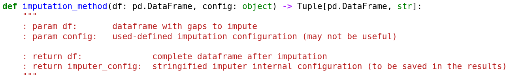

Each imputation method would have minimal interactions with the rest of the
pipeline, only receiving a dataframe with gaps and returning the same dataframe,
with imputed values.

Another goal I had was to make the pipeline easy to use with minimal changes to
the code. For that, I created a complete user interface for each step of the
pipeline.

  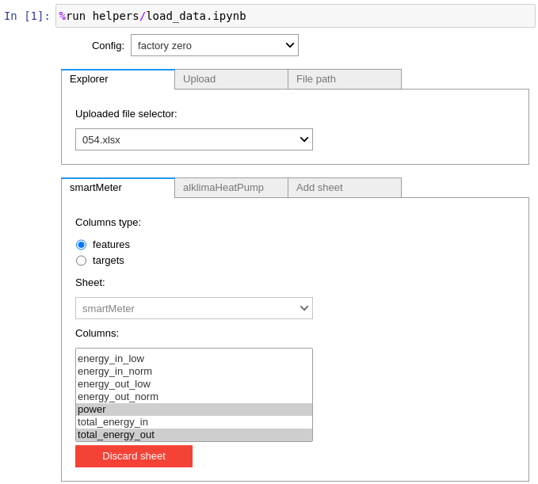
  
<i>Example of a UI element: data loader and feature/targets picker</i>

On the other hand, I knew some code I wrote for the pipeline would be useful
for other scripts we would write, so I wrote it with a focus on readability
and ease of use.  
One example of that is the [`DataFrameLoader`](https://github.com/thuas-imp-2021/thuas-imp-2021/blob/main/helpers/DataFrameLoader.ipynb)
class, which simplifies data loading from different sources, feature and targets
selection, while caching data for loading times efficiency.

Overall, most of the code was [typed using python's typing module](https://docs.python.org/3/library/typing.html)
to make it self-explanatory when possible, and commented otherwise.

**Result:** The unique imputation function interface limited the imputation
methods scope and minimized the risk. We especially saw that around the end of
the project, when I was experimenting with Recurrent Neural Networks out of the
pipeline, and got biased results that I later discovered were due to wrong gaps
creation.

Also, the fact that the code was quite readable and well split made it possible
for Albert to later help me on improving the pipeline and adding features.

In the end, the pipeline succeeded in providing a simple way to test methods and
give non-biased comparisons.

**Reflection:** However I feel like I spent too much time on writing the first
version of the pipeline, especially to create the user interface instead of
letting people modify the code to fit their needs. It proved useful, but maybe
not worth the time I spent on it, that could have been used elsewhere.  
However the pipeline proved to be crucial by the end of the project, as it sped
up by a lot results visualization and methods evaluation and comparison.

### Implementing a Recurrent Neural Network for imputing time series data

> This part will not go into technical details as it will be further discussed
in the [predictive analysis](#subject-2-predictive-analysis) part. Instead,
it will relate how I experienced this task.

**Situation:** In the beginning of November, as already quite a lot of
imputation methods had been developed and evaluated, we still missed a machine
learning solution to match Baldiri's expectations and to complete our research.

It was mainly Jesús' task, but he seemed to be struggling on this, and I had
just finished working on the pipeline, so I was available to help him.

After Jesús had tried a few machine learning methods such as Convolutional
Neural Networks and found out they did not fit our problem, we decided to focus
on Recurrent Neural Networks. I will explain [later](#selecting-a-model) what
led us to choosing this algorithm.

**Task:** Our task was then to train a Recurrent Neural Network on our data,
evaluate its performance and compare them to those of other imputation methods.

**Action:** This was my first experience with neural networks in Python. I
first practiced on lectures examples, to understand how RNNs work and to what
extent techniques such as data preparation, normalization, feature selection and
hyper-parameters optimization could have an impact on the model's results.

After that, Jesús and I conducted researches and experiments to select a model.
Once we did, we made it fit our datasets, trained it and I optimized its
hyper-parameters using a genetic algorithm.

Although the model was then able to predict one value given a sequence of values
as input, we needed to make it impute multi-step gaps. Moreover, to simplify
evaluating and comparing it to other methods, it needed to fit to the pipeline.  
For that, I turned it into an [imputer function compatible with the pipeline](https://github.com/thuas-imp-2021/thuas-imp-2021/blob/main/imputers/RNN.ipynb).
It would be provided with a model and a dataset with gaps, and walk forward
through the dataset, predicting one value at a time.

**Result:** With that, we were able to evaluate the model and compare a machine
learning method to other methods. It overall performed pretty well, as long as
it was provided with decent correlators.

**Reflection:** The main limitation of our model was the fact that it only
predicted one value at a time, given the X values before it. For imputing
large gaps, it would mean that at some point, predictions would be solely based
on predicted values, which would add a bias to the prediction.

One solution to that problem, proposed by Jeroen, was to use an encoder-decoder
architecture. I undertook this task but unfortunately ran out of time before
the end of the project. I am very disappointed that I did not achieve this in
time, however I learned a lot from this mistake and in the time spent on trying
to implement this architecture.

### Conclusion on my own contribution to the project

After all, I very much enjoyed this minor and the project, but felt overworked,
especially in the last two months, partly by my fault, as I could have divided
my tasks more efficiently and undertook some of them alone. This, in addition
to the different motivations and technical backgrounds in the group often led
to an uneven workload between group members.

[Back to the table of contents](#table-of-contents)

## Reflection on my own learning objectives

**Situation:** I am a 4th year student at Epitech, a IT expert school in France.
The curriculum offers the opportunity to spend the 4th year abroad, in one of
more than a hundred partner universities from all over the world.

My school helped me develop solid technical foundations in many languages and
domains, but I only scratched the surface of artificial intelligence, even
though it made me very curious for years. Indeed, I read a lot about it, but
rarely had the opportunity to practice, either through personal projects or for
school.

Last summer, I did a 4-months internship in a data sciences company, working
with data scientists, but my work was to develop efficient tools using C++ to
help them, I did not dive that much into actual data sciences.

Finally, my home school graduation project involves data sciences. Learning
about it will definitely help me and my group to reach our project goals.

**Task:** This minor was the perfect opportunity to get a good grasp of what data
sciences really were in practice. I don't intend to turn this knowledge into a
professional career, however it may be very useful at times to help me solve
software engineering problems.  

**Action:** I have always been way more interested in practice than in theory.
When working on a project, I would rather go headlong into code and experiments
than to do the writing. For that, I was lucky that Ramon and Juliën were up to
do the writing. It allowed me to experiment a lot with what I learned during
lectures and in papers.

Throughout the whole project, I tried to undertake a wide variety of subjects,
such as data manipulation, cleansing, visualization, classification, prediction,
model validation, model optimization, drawing up conclusion from data, ...

**Result:** In the past years, I had read quite a lot about data sciences and
machine learning, but everything I learned seemed untied and unclear.  
Thanks to this minor's resources (lectures and classes on DataCamp) and my
practice, I feel like I have connected the dots, and everything appears more
clear to me. I now have a good intuition on how to deal with a data science
problem.

**Reflection:** Even though I got involved in pretty much every aspect of the
project and learnt a lot, I somewhat regret that the Imputation project was
quite specific on imputation methods. For instance, I would have liked to
practice more classification models or some machine learning techniques.

[Back to the table of contents](#table-of-contents)

## Reflection on the group project as a whole

**Situation:** Our group was composed of 6 students from various nationalities
and educational backgrounds. Some of us, including me, had studied software
engineering, some had already dealt with data sciences, whereas others were not
quite familiar with programming and had to improve their programming skills.

For all of us, this was our first time in an English-speaking class. Also, due
to the current health context, we had to alternate between all together at the
university or only some of us, or even all remotely.

**Task:** In order to carry out the project, we needed to work together
efficiently, divide the work, track everyone's progress and help each other
when necessary.

**Action:** From the start of the project, we set up a SCRUM methodology using
a Jira board. The goal was to divide the tasks, assign people to them, and keep
track of the group progress. We worked with sprints of two weeks, meaning that we
defined tasks that were feasible within two weeks, and at the end of each sprint
we would review the work done, create new tasks and see how to improve our
workflow.

Moreover, we planned stand-up meetings to work as a group, as well as weekly
meetings with our project owner and each teacher individually.

As for the work, we stored our literature research and writing on a shared
OneDrive space, prepared most of our presentations together on [Canva](https://www.canva.com/),
conducted code experiments on the CPU and GPU servers provided by the school and
kept it all backed up and versioned on a [GitHub repository](https://github.com/Albert-Corson/imp-thuas/)
created by Albert.

**Result:** As English was not the mother tongue for any of us, at times it
induced misunderstandings, whether on what was expected from the teachers or
from other group members, or when communicating ideas and personal opinions on
the work done.

Meeting with teachers helped a lot to give advice, propose solutions to what
we were stuck on, either on the code or in the writings, and warned us about
possible mistakes we would have made otherwise. They have made themselves very
available even for answering questions in one-to-one meetings with members of
the group.

Meetings with Baldiri also helped, as he was very willing to help and motivating,
and never hesitated to clear misunderstandings out.

Concerning the group work organization, we quickly ended up not using Jira as
much as we could have. Some tasks were delayed, lasted more than expected, were
not up to date.

Finally, collaboration on the technical part was sometimes made uneasy, mainly
due to the difficulty to split large tasks.

**Reflection:** Overall we had a pleasant group dynamic, helped each other when
needed, and carried out the project together well.

However by the end of the project, the workload felt uneven, and some of us
worked unreasonably late, but nevertheless, it didn't create any internal
conflict, and we kept a healthy collaboration atmosphere, which was crucial to
finishing the project properly.

Distributing the workload more evenly throughout the duration of the minor
probably would have avoided this situation.

That being said, apart from the deception of not being able to include the
encoder-decoder RNN, I am pretty proud of what we did as a group, and of the
paper we delivered. I believe we answered the research question properly, with
well conducted work, considering that we were almost all completely new to this
domain at the beginning of the minor.

[Back to the table of contents](#table-of-contents)

## Subject #1: Research project

### Task definition

The IMP project aims to provide guidelines for choosing imputation methods for
Building Management System (BMS) time series data. Indeed, sensors often fail to
either collect or send data, which results in gaps in datasets, that can have an
impact on whatever use is made of this data.

The project owner was the research group Energy in Transition from THUAS, and Mr.
Baldiri Salcedo Rahola from this research group accompanied us through the whole
project. The research group works in collaboration with Factory Zero, a company
which, among other things, produces and monitors energy-neutral houses in the
Netherlands. Factory Zero provided us with the data of around 120 houses over
the year 2019.

In previous work done by the research group and Factory Zero, the method chosen
to impute missing data proved to have an impact on the quality of their results.
Depending on the type of data and the gaps sizes, some methods performed better
than others at predicting trends or exact values, depending on the end-use.
For instance, to analyse a household water consumption, imputing showers at
some point in the day would suffice, even if they are not imputing at the right
time, whereas to accurately predict power usage at a specific point in time,
imputing values accurately would be important.

Considering all these parameters, providing guidelines for each situation would
then make it easier for the research group and Factory Zero to choose the
appropriate imputation method. This led us to the following research questions:

**Main question:**

*Which imputation techniques should be applied for data imputation in building
energy time series data?*

**Sub questions:**

1. *What imputation methods are known for imputing time series data?*
2. *Which imputation techniques are best suited for what gap sizes?*
3. *What imputation techniques are best suited for which types of data?*

### Evaluation

For the future of this research, the machine learning model should be improved
to be able to draw realistic conclusions about it. Indeed, the current
architecture theoretically induces bias in its predictions when predicting
multi-step gaps. As stated before, the encoder-decoder architecture seems very
promising and appropriate, it should be a point of interest. This would also
make it possible to train the model to predict a correct trend rather than
trying to minimize the prediction error.

Also, I believe that it should be able to make profit of the data following the
gap to impute the gap itself, as well as using the data before as our models
already do. I attempted to do that with bi-directional RNN, but got stuck when
it came to predicting multi-step gaps, as the data right after one value of the
gap was not also missing. This is a clear advantage of imputation over
prediction, but so far our models apply the same method as for predicting
upcoming data. This, combined with better using correlated features, as for now,
only RNN uses correlated data for its predictions.

Finally, our research intentionally focused on comparing imputation methods
using statistics to evaluate the quality of the imputation itself. This was the
goal defined by our project owner. However, it would be interesting to evaluate
how different imputation strategies impact results obtained from the use of
imputed data, in different scenarios, as forecasting.

### Conclusions

In order to answer the research question, we tried out a lot of different
imputation methods. From the simplest forward-filling methods, statistics-based
filling, hot deck, single or multi-linear regression, to machine learning
solutions, we experimented with a wide variety of methods.

As a result, we found out that each of these methods fulfil specific objectives:
some are easier and faster to train or to run but offer sufficient results
depending on the expectations, whereas some others perform better at predicting
trends, while others predict more accurately the values, by minimizing their
predictions error. Also, some may perform to a different extent depending on the
size of the gaps they have to impute.

Before drawing conclusions, we visualized the imputation using a script Albert
wrote, which plotted a gap from each target and gap type, while outlining the
imputation results of each method. This helped us understand how each method
works, which led to further improvements of some methods before drawing the
final conclusions. All visualizations can be found in [the notebook](https://github.com/thuas-imp-2021/thuas-imp-2021/blob/pipeline/plot-comparison-data.ipynb),
but here is an example:

  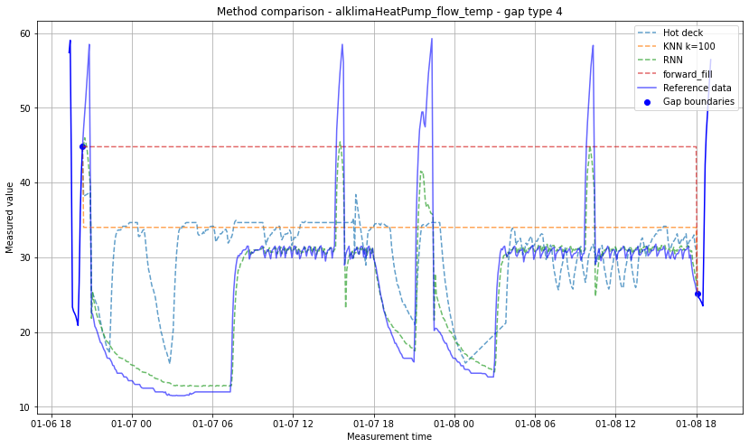
  
<i>Method comparison for alklimaHeatPump flow_temp column on gap type 4</i>

From the combination of these graphs and [quantitative methods comparisons](https://github.com/thuas-imp-2021/thuas-imp-2021/blob/pipeline/playground.ipynb)
from another script made by Albert, we were able to answer the last two
sub-questions (*Which imputation techniques are best suited for what gap sizes?*
and *What imputation techniques are best suited for which types of data?*) in a
table:

| Data type | Gap type 1 | Gap type 2 | Gap type 3 | Gap type 4 | Gap type 5 | 
| --------- | ---------- | ---------- | ---------- | ---------- | ---------- |
| Nominal   | Hot-deck   | Hot-deck   | Hot-deck   | Hot-deck   | Hot-deck   |
| Ratio     | Hot-deck   | Hot-deck   | Hot-deck   | Hot-deck   | Hot-deck   |
| Interval  | RNN        | RNN        | RNN        | RNN        | RNN        |

### Planning 

At the start of the minor, we were advised by our lecturers to use the SCRUM
method. All the members of the group were somewhat familiar with agile or even
the SCRUM method, and had used them in previous projects. So we organized our
work and split our tasks in sprints of two weeks on a Jira board.

  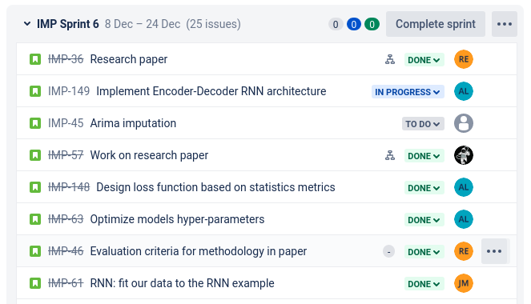
  
<i>A part of the backlog for our project</i>

Moreover, we conducted weekly meetings with each teachers individually as well
as our project owner, in order to keep them updated on our progress, collect
feedback and get answers to our questions.

Internally, we communicated via a WhatsApp group or via Teams calls, and met
at the university to work together at least once a week, but it became more
frequent by the end of the project as the deadline approached.

[Back to the table of contents](#table-of-contents)

## Subject #2: Predictive analysis

### Selecting a model

I started off the project with the simplest imputation strategy possible, in
order to quickly have a base to compare other methods with. When searching for
widely used imputation methods, [I stumbled upon an article](https://towardsdatascience.com/6-different-ways-to-compensate-for-missing-values-data-imputation-with-examples-6022d9ca0779)
which compares a few methods. The simplest ones were imputation using constant
values (zero, mean, median) and interpolation. However using a constant value
didn't seem interesting, so chose [2nd order spline interpolation](https://github.com/thuas-imp-2021/thuas-imp-2021/blob/pipeline/imputers/interpolate.ipynb).

Later in the project, I joined Jesús to try a machine learning method. Baldiri
wanted us to include at least one machine learning method in the research paper,
and according to [several papers](https://www.nature.com/articles/s41598-018-24271-9),
Recurrent Neural Networks seemed to be the state-of-the-art for imputing
multivariate time series with missing values.

### Configuring a model

When trying out Recurrent Neural Networks, I started with trying to reproduce
the example from Jeroen's lectures. I recreated it, and played a bit with it,
trying to get a good grasp of how RNNs work, and how each hyper-parameter
influences the model's performance.
Aside from the lecture, I read about different architectures that could be used
for imputing missing data for building energy data, mainly from two papers
([[1]](https://booksc.eu/book/81720800/7b299c) and [[2]](https://www.nature.com/articles/s41598-018-24271-9)).
These papers discussed two promising architectures: a variation of GRU, and
bi-directional LSTM. I tested these two configurations and eventually observed
slight performance improvements on the lecture example dataset.

After these experimentations, Jesús and I moved on to adapting RNN to Factory
Zero's house data. From my experimentations, we chose to use one-directional GRU
architecture.

### Training a model

When training our first models, we faced overfitting after some epochs.

  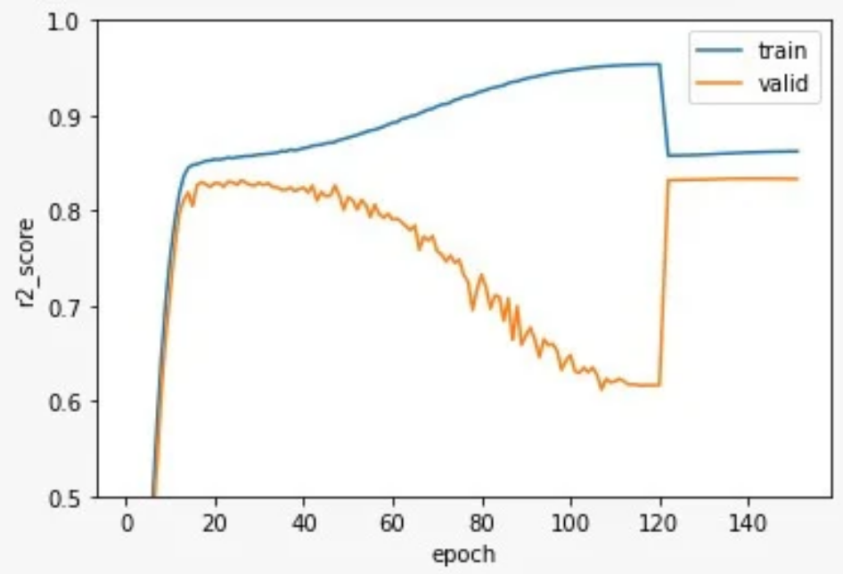
  
<i>Validation curve that shows overfitting</i>

> Note that at epoch 120, we reset the model to the state where it's validation
loss is the lowest, before continuing the training a bit further with a smaller
learning rate. This explains the strange shape at the end of this curve. We did
the same in some trainings later.

We then realized that this could be avoided by selecting correlated features to
help predicting the target. Indeed, so far we tried to predict the heat pump's
flow temperature using only the flow temperature and timestamp as features.  

[I plotted a heatmap](https://github.com/thuas-imp-2021/thuas-imp-2021/blob/pipeline/corr.ipynb)
showing the correlation between each field of Factory Zero data to help us
choose the most correlated columns.

  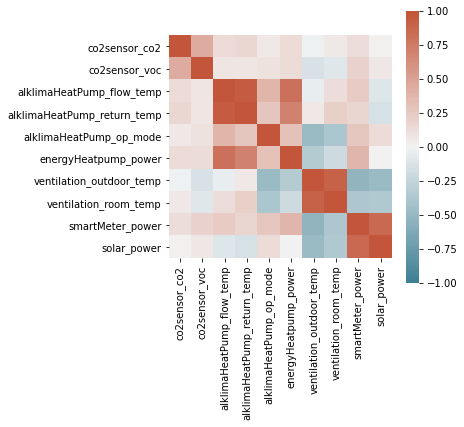
  
<i>Correlation matrix of the Factory Zero sensors data</i>

After adding the two most correlated columns (`alklimaHeatPump return_temp` and
`energyHeatpump power`), we obtained much better results.

  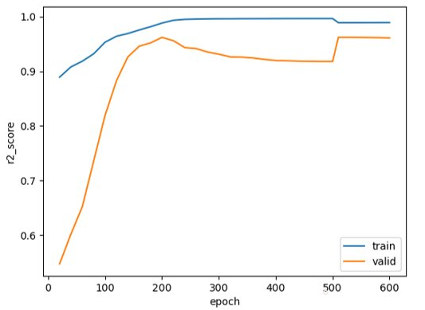
  
<i>Validation curve that no longer overfits, thanks to better feature selection</i>

These results were satisfactory, but we wanted to improve them further, by
tuning the model's hyper-parameters. To do that, I used a technique I learnt
during an internship last summer: hyper-parameters optimization using a genetic
algorithm.  
I used a genetic algorithm very much similar to [this one](https://github.com/thuas-imp-2021/Learning-Lab/blob/main/genetic-algorithm.ipynb),
which generated random set of hyper-parameters and evaluated them using
[this script](sources/GA/rnn-fzero.py). The evaluation fitness was the max
`r2_score` obtained while training with the given hyper-parameters. This way,
I run the genetic algorithm for 40 generations and 21500 individuals, to improve
our `r2_score` from 0.85 to 0.963 with the following parameters:

| Parameter     | Description                                                               | Bounds     | Optimized value |
| ------------- | ------------------------------------------------------------------------- | ---------- | --------------- |
| `window_size` | size of the input window to feed to the RNN                               | 2-12       | 12              |
| `batch_size`  | number of training samples provided to the trainer in one training pass   | 5-32       | 5               |
| `num_layers`  | number of hidden layers                                                   | 1-5        | 1               |
| `hidden_size` | size of the hidden layers                                                 | 2-100      | 95              |
| `loss`        | loss function to use for the training                                     | MSE, Huber | MSE             |
| `rnn`         | RNN architecture to use                                                   | GRU, LSTM  | GRU             |

### Evaluating a model

For the final paper, we wanted imputation results for different targets. For
that reason, I trained models for each target. Each model uses different features,
according to the correlation matrix. Also, I wanted to evaluate the impact that
adding timestamp or timedelta (difference between each observation timestamp and
the previous observation timestamp) to the features had on the model's performance.

To do this, I trained models on each target using [this script](https://github.com/thuas-imp-2021/thuas-imp-2021/blob/main/rnn-trainer.ipynb),
adding the timestamp alone, the timedelta alone, both, or none. The results are
presented in the table below. As a matter of fact, using none resulted in an
overall slight improvement.

| Source      | Target                        | r2_score       | r2_score       | r2_score                    | r2_score  |
| ----------- | ----------------------------- | -------------- | -------------- | --------------------------- | --------- |
|             |                               | with timestamp | with timedelta | wih timestamp and timedelta | with none |
| KNMI        | Temperature                   | 0.96648        | 0.96844        | 0.9674                      | 0.9689    |
| KNMI        | Relative atmospheric humidity | 0.83019        | 0.86689        | 0.86335                     | 0.86642   |
| KNMI        | Global Radiation              | 0.74355        | 0.90357        | 0.87708                     | 0.90472   |
| FactoryZero | alklimaHeatPump flow_temp     | 0.94248        | 0.40943        | 0.39286                     | 0.94214   |
| FactoryZero | alklimaHeatPump op_mode       | 0.90225        | -0.10337       | -0.06115                    | 0.90194   |
| FactoryZero | smartMeter power              | 0.82267        | 0.42267        | 0.34906                     | 0.83316   |
| FactoryZero | co2sensor co2                 | 0.97538        | -2.27796       | -2.32368                    | 0.97715   |

### Visualizing the outcome of a model

Once the models were trained on training data, it was necessary to verify their
ability to impute multi-step gaps. To do this, I ran the model through our
pipeline, to load the data, create gaps of different sizes, impute them and then
evaluate the results.  
After that, I used scripts written by Albert and Juliën to compare RNN results
to other methods, plotting a specific gap, or calculating the variance error of
imputations using different methods.

  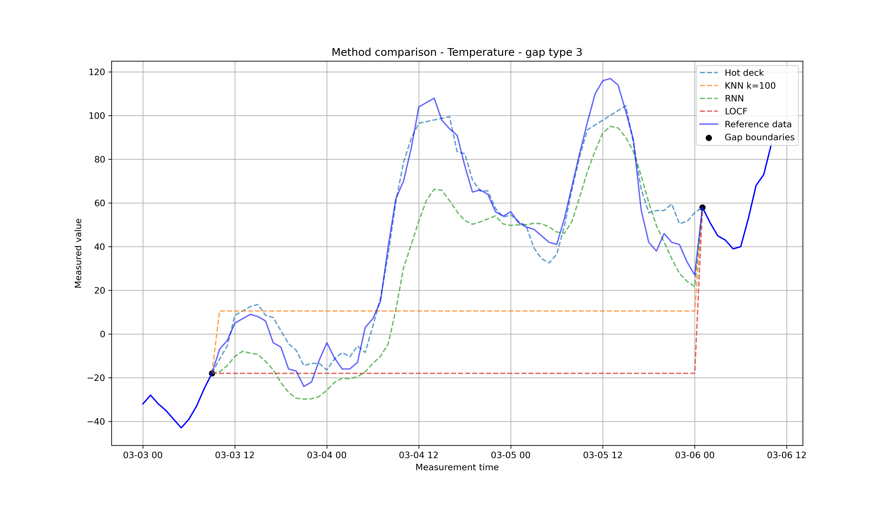
  
<i>Method comparison on one gap of the KNMI Temperature target</i>

  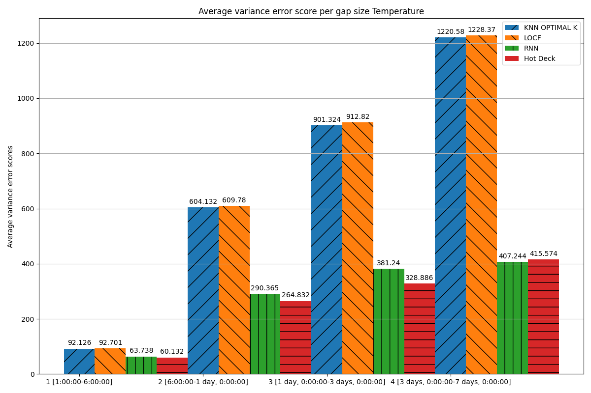
  
<i>Average variance error per gap on the KNMI Temperature target</i>

The variance error is an indicator of how well the trend of the original dataset
was followed in the imputed data, the lowest the better. Here, for imputing
temperature, RNN visibly performs really well at predicting the trend.

> RNN models were trained to minimize the prediction error (using the MSE loss
function), however they also performed well in most cases at predicting the trend.

[Back to the table of contents](#table-of-contents)

## Subject #3: Domain knowledge

### Introduction of the subject field

Building Management Systems generate large amounts of data over time by
gathering measurements from various sensors spread all over a building's
equipments. Examples of these sensors can be the temperature of a room or the
energy or water consumption of the household. These data can then be analyzed
and used to make predictions and assumptions useful for tasks such as better
managing the building energy consumption and production, or preventing
equipment breakdowns.

However, due to sensors malfunctions, data transfer or storage errors, it
happens quite often that data goes missing. Missing data in time-series make
it impossible for models to train or use the data. For this reason, missing data
must be imputed.

Some of the data collected by these sensors can be hard to impute, such as power
usage or co2 levels, as they can vary a lot in a short time span as a result of
many different factors, measurable or not. Also, due to the way they work
internally, some imputation methods can perform better at predicting certain
data types: nominal values (operational mode of the thermostat), interval
(thermostat temperature), ratio (power usage). For that reason, selecting the
right method to impute a given sensor data can be an uncertain and
time-consuming process.

Over the past years, there have been a lot of research about specific known
imputation methods, or new models propositions, tested on specific BMS sensors
data. The focus of our research was not to propose a new method, but rather to
give an overview of what exists and provide guidelines to choose from those
methods depending on the data to impute and the size of the gaps of missing
data.

Also, depending on the end-use of the data, it may be more profitable to predict
a correct trend over minimizing the prediction error. To this day, in most if
not all researches in that domain, the most used evaluation metric is RMSE (Root
Mean Squared Error), which measures the prediction error of a model. Even though
we used this metric, we also looked at the difference between the variance of
the original dataset (without gaps), and the variance of the dataset after
imputations of manually created gaps. Adding that insight to our research gives
the reader the possibility to choose an imputation method accordingly to his
objectives.

### Literature research

As the project started, we needed to read some existing literature on the
subject field. Each member of our group selected resources that seemed
interesting to the study.

I personally selected these sources:

- [R-miss-tastic: A resource website on missing values - Methods and references for managing missing data](https://rmisstastic.netlify.app/bibliography/):
A whole website dedicated to data imputation. It gathers many references on the
different aspects of the subject. It sums up the hard stuff and is very easily
understandable. 
- [Max Kuhn and Kjell Johnson (2019), Feature Engineering and Selection: A Practical Approach for Predictive Models. Chapter 8: Handling Missing Data](https://bookdown.org/max/FES/handling-missing-data.html):
A chapter is dedicated to handling missing data, it does not only discuss data
imputation, but other methods as well. It gives a global understanding of the
subject. 
- [C.M. van Kampen, Missing Data Imputation Based On Probabilistic Data](https://essay.utwente.nl/79142/1/Missing_data_imputation_based_on_probabilistic_data.pdf):
An essay aiming to compare different imputation methods. The interesting part I
think is about data correlation. It analyzes relations between data fields, to
do more accurate imputations. 
- [E Afrifa-Yamoah,U. A. Mueller,S. M. Taylor,A. J. Fisher (2020), Missing data imputation of high-resolution temporal climate time series data](https://rmets.onlinelibrary.wiley.com/doi/full/10.1002/met.1873):
This one also compares multiple imputation methods for imputing missing weather
data, with several parameters (temperature, humidity, wind speed, ...). It shows
results as a comparison between the actual dataset and the imputed dataset. 
- [Will Badr (2019), 6 Different Ways to Compensate for Missing Values In a Dataset](https://towardsdatascience.com/6-different-ways-to-compensate-for-missing-values-data-imputation-with-examples-6022d9ca0779):
This one compares 6 data imputation methods, giving pros and cons for each, it
gives a quick overview of how we could tackle our problem, but does not go into
much details. 

Later, when working on Recurrent Neural Network, I made deeper research on that
subject and found those sources:

- [Niklas Donges (2021), A Guide to RNN: Understanding Recurrent Neural Networks and LSTM Networks](https://builtin.com/data-science/recurrent-neural-networks-and-lstm):
A comprehensive introduction to Recurrent Neural Networks: how they work, their
limitations and solutions to them.
- [Zhengping Che, Sanjay Purushotham, Kyunghyun Cho, David Sontag, Yan Liu (2018), Recurrent Neural Networks for Multivariate Time Series with Missing Values](https://www.nature.com/articles/s41598-018-24271-9.pdf):
GRU-D model proposition based on Gated Recurrent Units (GRU).
- [Wei Cao, Dong Wang, Jian Li, Hao Zhou, Yitan Li, Lei Li (2018), BRITS: Bidirectional Recurrent Imputation for Time Series](https://proceedings.neurips.cc/paper/2018/file/734e6bfcd358e25ac1db0a4241b95651-Paper.pdf):
Model proposition based on bi-directional RNN to perform bi-directional
uncorrelated and correlated recurrent imputation.
- [Jason Brownlee (2018), Multi-Step LSTM Time Series Forecasting Models for Power Usage](https://machinelearningmastery.com/how-to-develop-lstm-models-for-multi-step-time-series-forecasting-of-household-power-consumption/):
Guide to build a Recurrent Neural Network to forecast power usage.

### Explanation of Terminology, jargon and definitions

In the table below, I try to explain the technical terms used in this document.

| Term               | Explanation                                             |
| ------------------ | ------------------------------------------------------- |
| Data science       | Using various tools to examine large data sets and extract valuable information. |

[Back to the table of contents](#table-of-contents)

## Subject #4: Data preprocessing

### Data exploration

In the first week of the project, I visualized several KNMI and FactoryZero data
fields to understand how it was shaped.

Using matplotlib combined with Jupyter notebooks, I was able to plot entire
datasets (one field at a time to keep it readable), and zoom in as much as
necessary to get a deeper understanding of the data. I shared those
visualizations with my group and our project owner, who then explained a bit
more how these data were collected and what every field was really about
(the sensor, its location in the building, the measured data and its unit).

  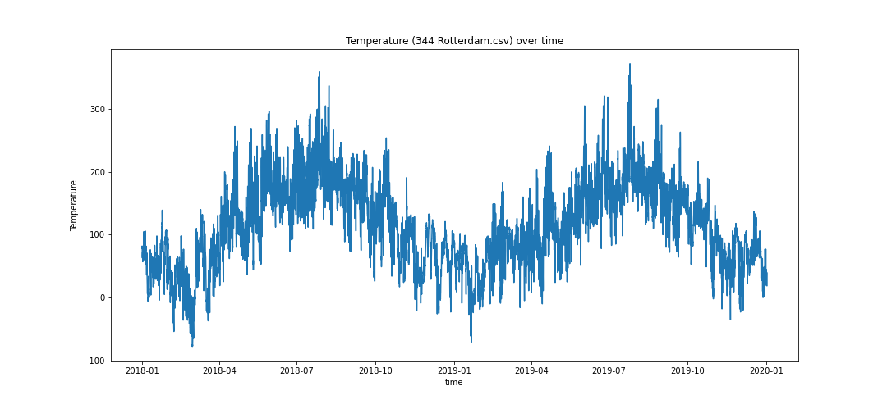
  
<i>KNMI Temperature plotted over time</i>

To make sure that the datasets we had were fit for training models (balanced
mostly), [I then plotted the distribution of their fields](sources/pipeline/dataset-distribution.ipynb).

  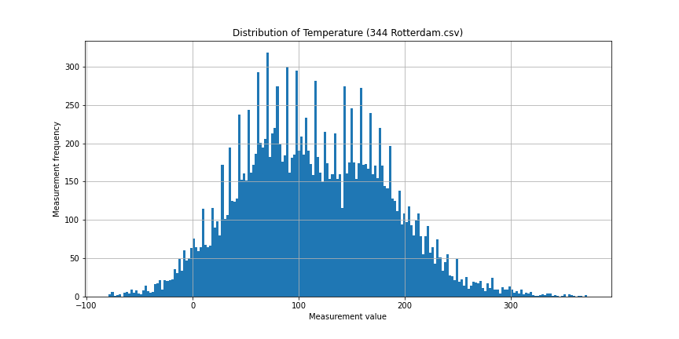
  
<i>KNMI Temperature dataset distribution</i>

As well as [the distribution of the time deltas](sources/pipeline/dataset-gaps-distribution.ipynb), to see if there was missing
data (gaps in real data was not present as rows with NaN values, but the rows
were simply missing. The way to detect gaps was to analyze the time difference
between each observation).

  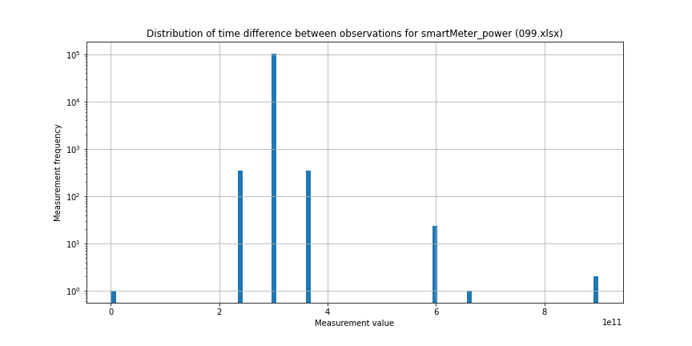
  
<i>Time deltas distribution on FactoryZero's alklimaHeatPump power (house 99)</i>

Some datasets had almost no gaps, whereas others had too many gaps to be easily
used for training and validation purposes.

After that, [I classified every field of the FactoryZero datasets](assets/f0-data-types.csv)
to determine their scale (ordinal, nominal, interval or ratio). Juliën did the
same on KNMI fields.

  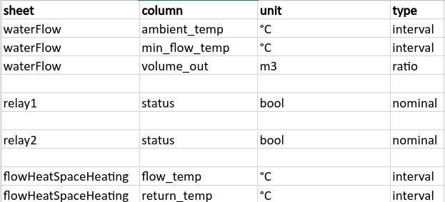
  
<i>Extract of the FactoryZero columns types classification document</i>

This helped us notice that there was no categorical value in the dataset, that
would otherwise have needed transformations.

Finally, as we planned to test some models that would use correlation between
fields, I [made a heatmap](https://github.com/thuas-imp-2021/thuas-imp-2021/blob/pipeline/corr.ipynb)
highlighting the correlation between each field of our datasets.

  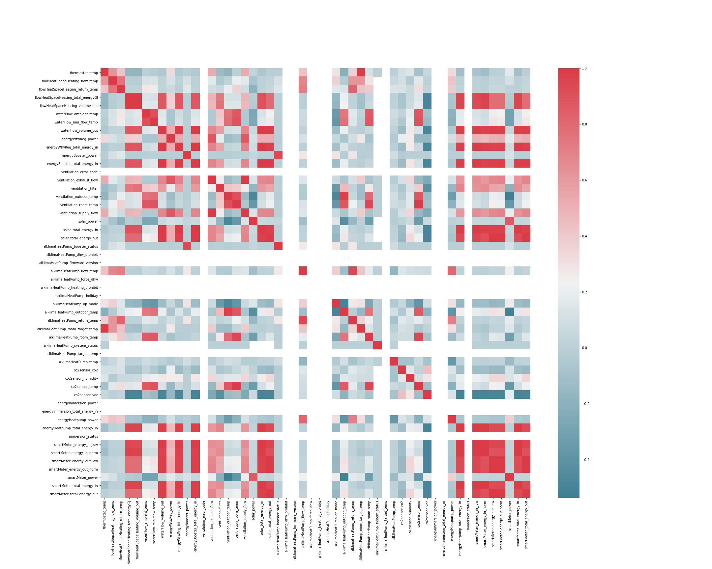
  
<i>Correlation heatmap for all of FactoryZero dataset fields</i>

This later allowed us to choose the most correlated fields for each target we
wanted to impute.

After this preliminary data exploration, we concluded that there was more than
enough data for training and validation. Although KNMI data was clean and did
not present missing data, FactoryZero datasets had a few gaps. Therefore, we
needed to select the best(s) dataset(s) to work with.

Moreover, the timestamps between the different sensors did not necessarily
match. Most of the time it did, but it could happen that an observation was
missing in one sensor data, while present in another's, sometimes even
timestamps differed only by a few seconds. This needed to be considered when
loading multiple features in the same dataset for models using correlation.

### Data cleansing

KNMI data was of great quality: time deltas were very consistent (exactly 1h
each), and no data was missing.

On the other hand, FactoryZero datasets had inconsistent time deltas and a few
gaps. Albert wrote a script to sort the datasets by "completeness", and
created a scoreboard of the datasets with the smallest amount of missing data.
It turned out that house 54 very almost complete, except for 2 or 3 10-minutes
gaps. Considering the size of the dataset, this was negligible. For most of the
project, we used this house to train and validate our models.

As we wanted a streamlined imputation and evaluation pipeline, we wanted to
keep our data as raw as possible, letting each individual imputation method
perform the data cleaning and preparation if necessary. For that reason, on the
pipeline scope, we did not perform outliers removal or any further data
cleaning. Also, as we were dealing with time-series data only, we did not have
duplicates to remove.

### Data preparation

Prepared the data in an appropriate way, transforming data, removing outliers,
filling in missing values, ...

According to the previous data exploration, we did not have any categorical
data to transform.

Also, once again, as we wanted our datasets as raw as possible before passing
them through each imputation method, we did not 

For RNN: data cleansing

### Data explanation

Described the entire dataset

- multiple sensors
- mostly interval and ratio data
- positive and negative correlations (ex: solar power / heat pump power)
- 

### Data visualization

Visualized the data in support of decisions made for learning the model

[Back to the table of contents](#table-of-contents)

## Subject #5: Communication

### Presentations 

| Date       | Implication                                                                   | Presentation                                                                           |
| ---------- | ----------------------------------------------------------------------------- | -------------------------------------------------------------------------------------- |
| 04-10-2021 | Created presentation support, presented slides 7-8, 10-13, answered questions | [internal presentation week 6](assets/presentations/internal-presentation-week6.pdf)   |
| 08-10-2021 | Created presentation support, presented slides 9-12, answered questions       | [external presentation week 6](assets/presentations/external-presentation-week6.pdf)   |
| 10-12-2021 | Created presentation support, presented slide 6, answered questions           | [external presentation week 14](assets/presentations/external-presentation-week14.pdf) |

### Learning Lab

During the minor, we were asked to give a Learning Lab, which is a 20-minutes
class about a data sciences-related subject not covered in the lectures.  
At first, Albert and Michael planned to give the Learning Lab on hot deck.
However, it was a default choice as we didn't have any other idea, and they were
not much motivated to do it. Until I started working with a genetic algorithm to
optimize our models hyper-parameters, and thought that would make a great subject.

I then wrote [this notebook](https://github.com/thuas-imp-2021/Learning-Lab/blob/main/genetic-algorithm.ipynb)
as a basic genetic algorithm to support [the presentation](https://github.com/thuas-imp-2021/Learning-Lab/blob/main/presentation.pdf)
that I prepared and gave together with Michael.

### Writing paper

Juliën was mainly responsible for writing the paper, but he asked each one of
us to write the part concerning what we worked on during the project.  
So I wrote [the part about RNN](writings/research-paper-rnn.md), and asked for
Jesús' and Juliën's feedback which were useful to shorten some paragraphs and
better rephrase sentences.

I also gave feedback on the whole paper and took part in many meetings to help
finishing the paper, by helping to draw conclusions from results, or by providing
tables and graphs.  
Some of them were [correlation matrices, correlation values](https://github.com/thuas-imp-2021/thuas-imp-2021/blob/pipeline/corr.ipynb)
and [kurtosis and skewness comparison between datasets](https://github.com/thuas-imp-2021/thuas-imp-2021/blob/pipeline/houses-comparison.ipynb)
to support conclusions drawn in the paper.

[Back to the table of contents](#table-of-contents)
